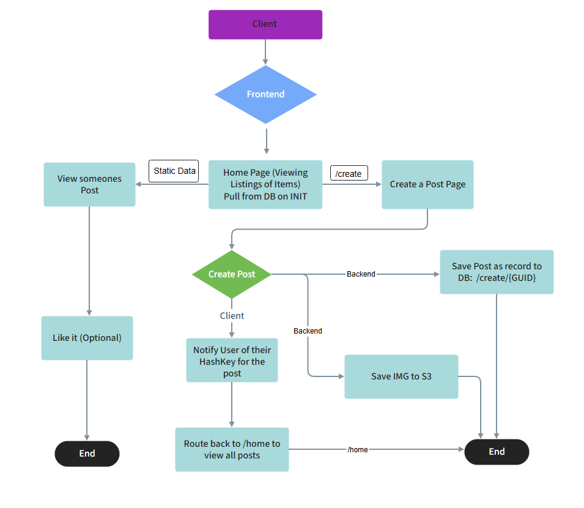

# 408 Final Project - CampusCart

## Project Spec

### Project Proposal: **CampusCart**

#### General Theme  
CampusCart is basically a buy/sell app built just for students. Think of it like Craigslist or Facebook Marketplace, but designed specifically for campus life. Students are constantly getting rid of stuff—books, mini fridges, furniture, clothes, even event tickets—and there’s never really been an easy, centralized place for it. So, the goal here is to build a clean, simple platform where students can post listings and other students can find things they need, all without having to deal with random strangers from the internet.

The theme falls under local e-commerce, with a focus on student-to-student trading. It’s not meant to be some giant platform or social media clone—it’s more like a lightweight, functional tool that just works.

#### What It’s Going to Do  
CampusCart will let users:
- Post items they want to sell, with info like a title, price, description, category, and a photo.
- Browse listings by category (textbooks, electronics, furniture, etc.).
- Search for items by category (using an index on the dynamo table for each category).
- View individual item details and contact the seller.
- Manage their own listings (edit or delete them when stuff gets sold).

It’s basically a place for students to get rid of stuff they don’t need and pick up things they do—without having to go off-campus or scroll through spammy posts. I’ll build a backend to handle all the data (with DynamoDB for the listings, and S3 for image uploads), and hook it up with a nice-looking frontend (using NextJS) that talks to the backend via REST APIs.

#### Target Audience  
This app is for **college students**, plain and simple. They’re always buying and selling stuff, especially at the beginning or end of semesters, when people are moving in or out. CampusCart gives them a safer and more local place to do that.

Long-term, it could also be used by faculty or student orgs trying to sell things like merch or equipment, but version 1.0 is just for students. Eventually, it might even require a .edu email to sign up, just to keep things tight and campus-only. It will not require users to login or provide any sort of authentication due to the time constraints of this project.

#### What Kind of Data It’ll Manage  
The main type of dynamic data CampusCart will deal with includes:
- Item listings:  
  - Title  
  - Description  
  - Price  
  - Category (like books, tech, furniture)  
  - Photo (uploaded by the user and stored in S3)  
  - Contact info (probably email/instagram - basically whatever the user is most comfortable providing to the public)  
  - Timestamp for when it was posted  

- Listing deletion or updates from the original poster. Upon a user creating a posting, a hashkey will be generated and stored on that record. The user will then get a popup notifying
  them that their post was successfully posted, and giving them this hashkey. Now, to delete or update the post they need to use that hashkey to do so. This is a bit of a work-around for
  a no-creds/no-login web app. 

#### Stretch Goals (aka cool extras that I definitely won't have time for)  
Once the main features are done and working, I’ve got a few ideas for extra stuff that could really level it up:

1. **User Accounts & Login System**  
   Let users create accounts, log in, and manage all their posts in one place. Could also limit signups to people with .edu emails.

2. **Favorites List**  
   Add the ability for users to “heart” or save listings they want to come back to later. --> This depends on the user having an account...

3. **Listing Expiration**  
   Automatically remove listings after 30 days (or let users renew them using their hashkey).

4. **Rating System**  
   Users could like posts(anonymous).

#### Final Thoughts  
CampusCart is a pretty practical project with a clear use case, and it’s something I’d honestly use myself. It hits all the full-stack checkboxes, gives me experience working with AWS and REST APIs, and it has a lot of room to grow with extra features if there’s time. It’s also way more interesting (and useful) than a generic to-do list app or something.

Overall, I think this is a solid project to build, and hopefully something that could even be used by real students down the line.

---

## Project Wireframe

